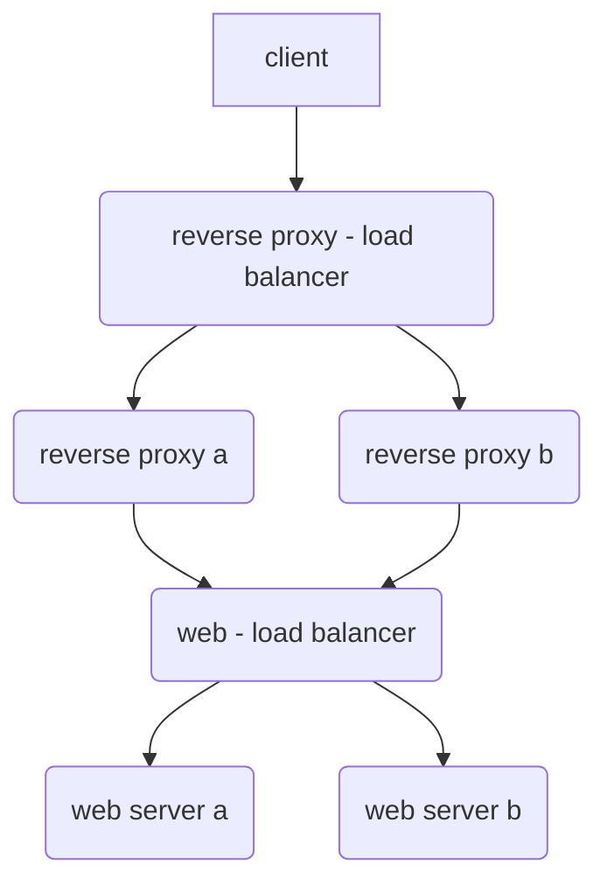
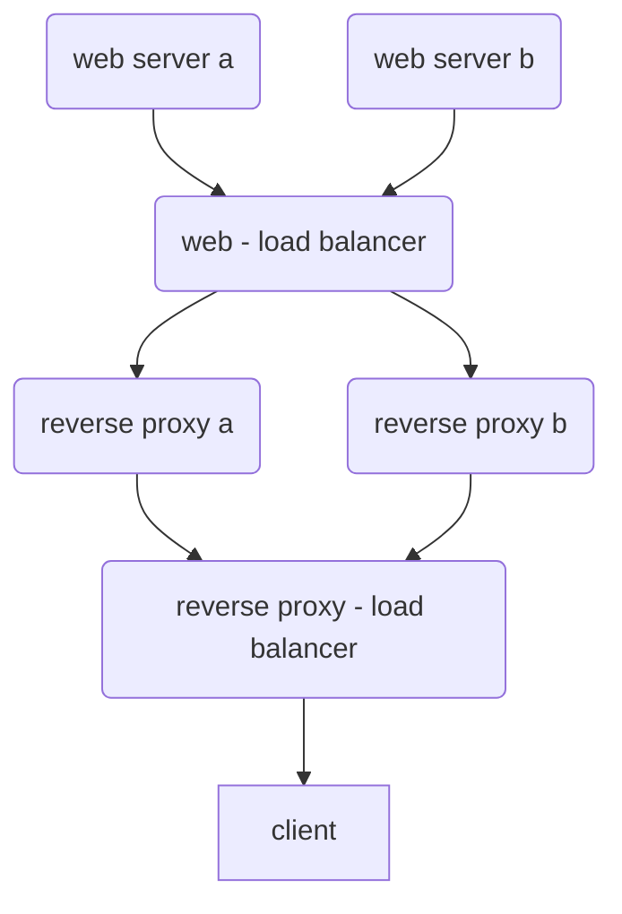

# calculate-api-needed-bandwidth

## variables
1. web servers count
2. Concurrent Users: Number of users simultaneously making requests.
3. Requests per User per Second: How frequently each user sends API requests.
4. Payload Size (bytes): Average size of the API request/response payload (in bytes).
5. Compression Ratio: The ratio of uncompressed to compressed size (e.g., if compression reduces size by half, use 2).
6. Protocol Overhead Fraction: Estimated overhead added by HTTP headers, TLS, etc. (e.g., 0.1 for 10% overhead).
7. 8: Converts bytes to bits.
8. Redundancy Factor: Multiplier to account for traffic spikes or unexpected load (e.g., 1.3–1.8).

## formula
Total Bandwidth (bps) = Concurrent Users × Requests per User per Second × Payload Size (bytes) × (1 / Compression Ratio) × (1+Protocol Overhead Fraction) × 8 × Redundancy Factor

## Example Calculation: 

**Suppose:**
1. Concurrent Users = 1,000
2. Requests per User per Second = 2
3. Payload Size = 10,000 bytes (10 KB)
4. Compression Ratio = 2 (payload is halved by compression)
5. Protocol Overhead Fraction = 0.1 (10% overhead)
6. Redundancy Factor = 1.5

**Plug into the formula:**
Total Bandwidth = 1,000 × 2 × 10,000 × (1/2) × (1+0.1) × 8 × 1.5
= 1,000 × 2 × 10,000 × 0.5 × 1.1 × 8 × 1.5
= 2,000 × 10,000 × 0.5 × 1.1 × 8 ×1.5
= 20,000,000 × 0.5 × 1.1 × 8 × 1.5
= 10,000,000 × 1.1 × 8 × 1.5
= 11,000,000 × 8 × 1.5
= 88,000,000 × 1.5
= 132,000,000 bps = 132 Mbps

## Notes
1. Web Servers Count: If you want per-server bandwidth, divide the total bandwidth by the number of web servers.
2. Bidirectional Traffic: If requests and responses have different sizes, calculate each direction separately and sum them.
3. Adjust for Real-World Factors: Always round up and add a safety margin for unexpected spikes or future growth.

## sample calculation for an ASP.NET Web API (4.5) hosted on IIS

Here's a sample calculation for an ASP.NET Web API (4.5) hosted on IIS in a single-server environment, using realistic IIS metrics from the search results:

### Example Scenario
1. API Payload Size: 15 KB (15,360 bytes) average request/response
2. Peak Concurrent Users: 500
3. Requests per User per Minute: 120 (2 requests/sec)
4. Protocol Overhead: 15% (HTTP headers, TLS)
5. Redundancy Factor: 1.5

### Bandwidth Calculation

**Formula**:
Total Bandwidth (Mbps) = (Payload Size × Requests/sec × 8 × (1 + Overhead) × Redundancy) / 1,000,000

**Calculation**:
1. **Requests per Second** = 500 users × 2 reqs/sec = **1,000 reqs/sec**
2. **Data per Second** = 15,360 bytes × 1,000 = 15,360,000 bytes/sec
3. **With Overhead** = 15,360,000 × 1.15 = 17,664,000 bytes/sec
4. **Bits per Second** = 17,664,000 × 8 = 141,312,000 bps
5. **With Redundancy** = 141,312,000 × 1.5 = **211,968,000 bps (≈212 Mbps)**

## Server Capacity Check (Using IIS Metrics[3](https://www.elastic.co/guide/en/beats/metricbeat/current/exported-fields-iis.html))

| Metric                                                 | Value    | Threshold   |
| ------------------------------------------------------ | -------- | ----------- |
| `iis.webserver.network.current_connections`            | 500      | ≤800        |
| `iis.webserver.asp_net_application.requests_executing` | 1,000    | ≤1,500      |
| `iis.webserver.process.worker_process_count`           | 1        | 1-4         |
| `iis.webserver.network.bytes_sent_per_sec`             | 106 Mbps | ≤1 Gbps NIC |

## Key Considerations

1. **Memory Requirements**
	- (Using [3](https://www.elastic.co/guide/en/beats/metricbeat/current/exported-fields-iis.html) metrics):
    - Each worker process (~500MB baseline + (15KB × 500 users)) ≈ **1.2 GB RAM**
    - Total: 1.2 GB × 1 worker process = **1.2 GB minimum**

2. **Storage IOPS** 
	(Based on [3](https://www.elastic.co/guide/en/beats/metricbeat/current/exported-fields-iis.html) counters):
	
```
Required IOPS = (Requests/sec × 2) + Log Writes
			  = (1,000 × 2) + 50 = 2,050 IOPS
```

3. **CPU Utilization** (Empirical rule):
```
CPU Cores Needed = (Requests/sec × 0.002) × Redundancy
			     = (1,000 × 0.002) × 1.5 = 3 cores
```

This calculation shows the server would require:
- **≈212 Mbps** sustained bandwidth
- **4 vCPU cores** (3 calculated + 1 buffer)
- **2 GB RAM** (1.2 GB calculated + buffer)
- **2,500+ IOPS** storage
- 1 Gbps network interface

**Note:** Always validate with actual IIS metrics ([3](https://www.elastic.co/guide/en/beats/metricbeat/current/exported-fields-iis.html) counters) during load testing and monitor `iis.webserver.network.total_bytes_sent` for historical analysis [4](https://serverfault.com/questions/1047777/track-outgoing-bandwidth-usage-of-single-iis-website-on-my-vps).

## Monitoring Setup 
(From [5](https://serverfault.com/questions/398415/real-time-and-historical-bandwidth-analysis-on-a-windows-based-iis-6-7-box))

```powershell
# Performance Monitor Counters to Track: 
"\Web Service(_Total)\Bytes Sent/sec"
"\ASP.NET Applications(__Total__)\Requests/Sec" 
"\Process(w3wp)\% Processor Time"
"\Memory\Available MBytes"
```

## Configuration Tips 
(From [6](https://learn.microsoft.com/en-us/iis/get-started/whats-new-in-iis-8/iis-80-using-aspnet-35-and-aspnet-45))

1. In IIS Manager:
```xml
<!-- applicationHost.config --> 
<applicationPools>
	<add name=".NET 4.5" managedRuntimeVersion="v4.0" />
</applicationPools>
```
    
2. Set queue limits:
```xml
<serverRuntime appConcurrentRequestLimit="5000" />
```

## impact of layered network architecture on bandwidth calculation

### example

**request journey**


**response journey**


client request 
	--> reverse proxy - load balancer 
	--> reverse proxy a or b
	--> web - load balancer
	--> web server a or b

web server a or b response 
	--> web - load balancer
	--> reverse proxy a or b
	--> reverse proxy - load balancer 
	--> client

### description

When you have a layered architecture with multiple reverse proxies and load balancers, the **total bandwidth required across the entire system is determined by the client-facing traffic**, but **each hop in the chain will carry the full payload**, effectively multiplying the internal bandwidth usage[1](https://serverfault.com/questions/247337/proxy-bandwidth).

### How the Setup Affects Bandwidth Calculation

#### 1. Bandwidth Is Consumed at Each Layer
- Each device (reverse proxy, load balancer, web server) in the chain forwards the entire payload to the next device.
- For a single client request, the same amount of data traverses each segment between devices.
- **Example:** If a user downloads a 100 MB file, that 100 MB will:
    - Travel from the web server to the web load balancer (100 MB)
    - From the web load balancer to the reverse proxies (another 100 MB)
    - From the reverse proxies to the reverse proxy load balancer (another 100 MB)
    - From the reverse proxy load balancer to the client (final 100 MB)
- **Total internal bandwidth usage:** 3× the client-facing bandwidth for this request[1](https://serverfault.com/questions/247337/proxy-bandwidth).

#### 2. Aggregate Bandwidth
- The **external bandwidth** (client to reverse proxy load balancer) is what you need to provision for client-facing traffic. 
- **Internal bandwidth** (between proxies, load balancers, and web servers) must be provisioned at each link, and each device must be able to handle the full aggregate traffic, since every byte is transmitted across each hop[1](https://serverfault.com/questions/247337/proxy-bandwidth).

#### 3. Potential Bandwidth Optimizations
- **Reverse proxies** can reduce bandwidth usage through caching and compression: 
    - If a reverse proxy caches responses, repeated requests for the same resource may not traverse the entire chain, reducing internal bandwidth[4](https://www.upguard.com/blog/reverse-proxy-vs-load-balancer).
    - Compression at the proxy layer can reduce the size of data sent to clients and between proxies, if enabled[4](https://www.upguard.com/blog/reverse-proxy-vs-load-balancer).
- **load balancers** may offer WAN optimization features (compression, deduplication, protocol acceleration) that can reduce the amount of actual data sent across the network, but each logical hop still “sees” the full payload unless caching or optimization is in use[3](https://wtit.com/wp-content/uploads/2016/10/f5-white-paper-myths-of-bandwidth-optimization-.pdf)[4](https://www.upguard.com/blog/reverse-proxy-vs-load-balancer).

#### 4. Formula Adjustment
If you ignore caching and compression for a worst-case scenario, the **total internal bandwidth** required is:

Total Internal Bandwidth = Client-Facing Bandwidth × Number of Hops

Where “hops” means the number of segments the data traverses (in your case: web server → LB → reverse proxy → LB → client, so 3 internal hops plus the client-facing segment).

**If caching or compression is used, adjust the formula by the cache hit ratio and compression ratio.**

#### Key Points
- Each network segment between devices must be provisioned for the full client bandwidth.
- Total internal bandwidth is a multiple of client bandwidth, based on the number of hops.
- Caching and compression at reverse proxies can reduce actual bandwidth usage.
- load balancers may offer WAN optimization, further reducing bandwidth needs if enabled[3](https://wtit.com/wp-content/uploads/2016/10/f5-white-paper-myths-of-bandwidth-optimization-.pdf)[4](https://www.upguard.com/blog/reverse-proxy-vs-load-balancer).

#### summary
Your setup means that for every byte delivered to a client, that byte is transmitted multiple times within your internal network, once for each hop between devices. This can significantly increase the total network bandwidth required inside your infrastructure compared to what is delivered to clients[1](https://serverfault.com/questions/247337/proxy-bandwidth)[4](https://www.upguard.com/blog/reverse-proxy-vs-load-balancer).
